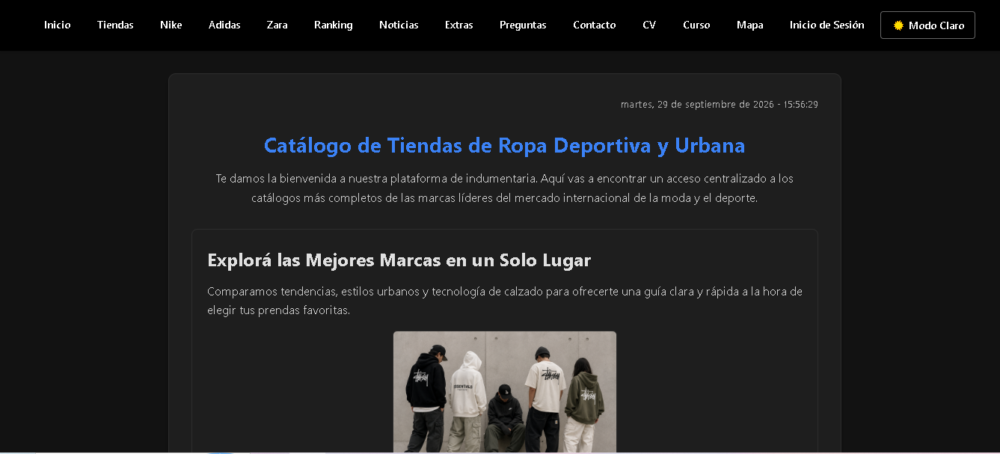
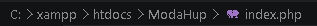
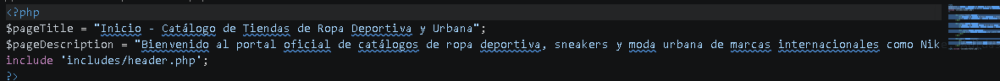
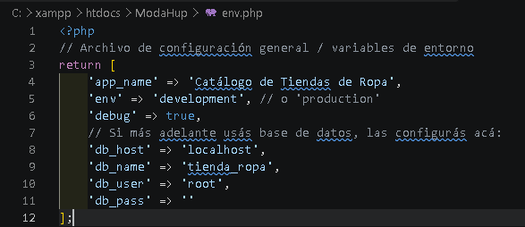
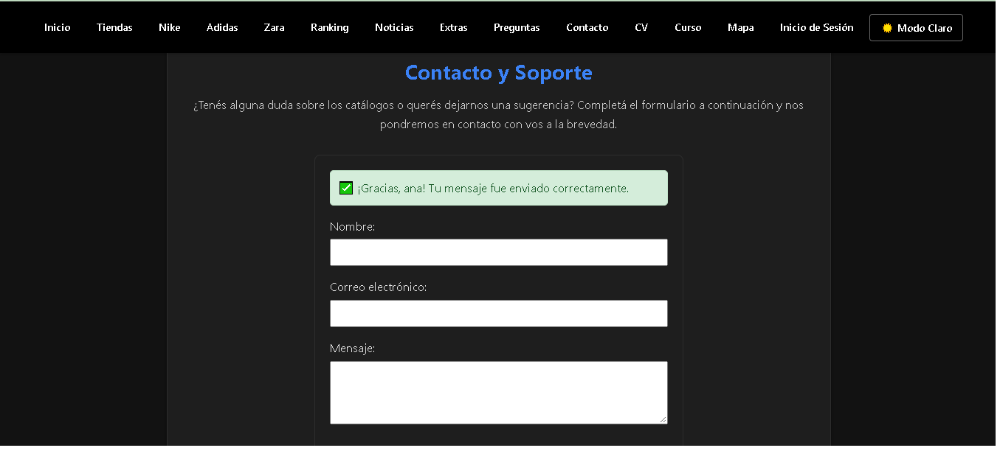
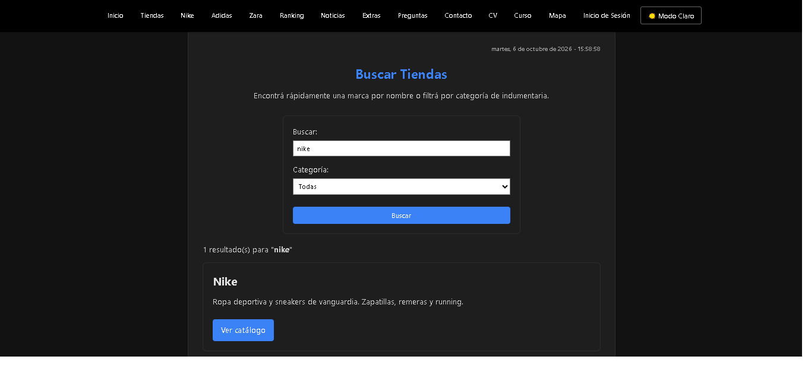
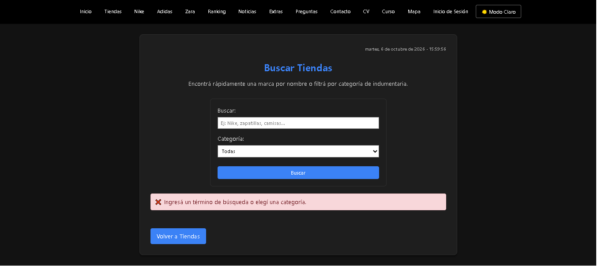
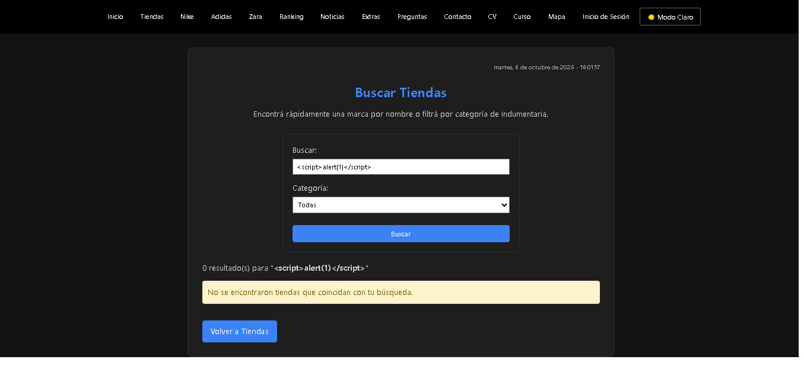

# 🛒 Catálogo de Tiendas de Ropa Deportiva y Urbana (Unidad 4 - PHP & SSR)

Aplicación web modularizada desarrollada para la gestión y visualización de catálogos de indumentaria urbana y calzado deportivo de marcas líderes (Nike, Adidas, Zara). Este proyecto corresponde a la evolución del hito estático a un entorno de servidor dinámico con PHP, Server Side Includes (SSI) y Renderizado Server-Side (SSR).

---

## 🎨 Enlace al Prototipo (Figma)
* **Diseño original UI/UX:** [Ver prototipo en Figma](https://www.figma.com/design/yhwdbeoqApCoIEwYfxAJXX/Sin-t%C3%ADtulo?node-id=3-17&t=XJZbYbaPcR1jmXXs-1)

---

## 🛠️ Tecnologías Utilizadas
* **Lenguajes:** PHP 8.x, HTML5, CSS3, JavaScript (ES6+).
* **Entorno de Servidor Local:** XAMPP (Apache).
* **Control de Versiones:** Git y GitHub (con flujo de ramas y commits atómicos).
* **Arquitectura:** Modularización mediante plantillas parciales (SSI).

---

## 🚀 Instrucciones de Instalación y Ejecución Local

Para clonar y poner en marcha este proyecto en tu entorno local:

1. Clonar el repositorio o descargar el código fuente dentro de la carpeta raíz de tu servidor local (`C:\xampp\htdocs\ModaHup`).
2. Duplicar el archivo `.env.example` y renombrarlo como `env.php` (o `.env` según configuración local).
3. Iniciar el servicio **Apache** desde el Panel de Control de XAMPP.
4. Abrir el navegador web e ingresar a la URL:
   `http://localhost/ModaHup/index.php`

---

## 📸 Evidencia de Funcionamiento
### 1. Servidor Local Ejecutándose
*Vista previa del sitio web corriendo de forma local en el navegador bajo el entorno de XAMPP:*

### 2. Estructura Modular (SSI)
*Vista del código fuente y organización de carpetas donde se aprecia la separación en plantillas (`header.php`, `footer.php`) y su inclusión mediante PHP:*

### 3. Navegación Dinámica y SSR
*Demostración del título dinámico en la pestaña del navegador combinando las variables del entorno con cada vista:*

### 4. Configuración de Variables de Entorno
*Evidencia del archivo `.env.example` presente en la raíz del repositorio:*

---

# 📝 Clase 5 – Procesamiento de Formularios (POST y GET) y Prevención de XSS

Todo el desarrollo de esta entrega se encuentra en la carpeta [`clase5/`](clase5/) (`contacto.php`, `buscar.php`, `tiendas.php`, `mapa.php`). Además, `includes/header.php` se ajustó levemente para que el menú apunte a estas versiones. Se incorporó lógica del lado del servidor para capturar y procesar datos enviados desde el navegador, aplicando sanitización estricta para prevenir ataques de Cross-Site Scripting (XSS, OWASP Top 10).

---

## 📋 Formularios Creados

### 1. Formulario de Contacto – Método POST (`clase5/contacto.php`)
* **Campos:** nombre, correo electrónico y mensaje.
* **Captura:** los datos se reciben con `filter_input(INPUT_POST, ...)`, exigiendo que sean de tipo string (si falta o viene como arreglo se trata como vacío).
* **Sanitización:** se aplica `trim()` a cada campo y todo dato que se muestra en pantalla se escapa con `htmlspecialchars($valor, ENT_QUOTES, 'UTF-8')`.
* **Validación en servidor:**
  * Campos obligatorios no vacíos (`empty()`).
  * Nombre entre 2 y 50 caracteres.
  * Formato de correo válido con `filter_var($email, FILTER_VALIDATE_EMAIL)`.
  * Mensaje entre 10 y 1000 caracteres.
* **Retroalimentación:** mensaje verde si el envío fue exitoso, mensaje rojo general si hubo errores y mensaje específico debajo de cada campo con problemas.
* **Persistencia:** ante un error, los campos conservan lo que el usuario había escrito. Si el envío es exitoso, el formulario se limpia.

### 2. Buscador de Tiendas – Método GET (`clase5/buscar.php`)
* **Campos:** texto de búsqueda (`q`) y categoría (`categoria`: Deportiva / Casual). Además, `tiendas.php` incluye un buscador rápido que envía la consulta a `buscar.php`.
* **Captura:** los parámetros se reciben con `filter_input(INPUT_GET, ...)`; el envío se detecta con `isset($_GET['buscar'])`.
* **Sanitización:** `trim()` sobre cada parámetro, verificación de tipo string y `htmlspecialchars()` al mostrar el término buscado.
* **Validación en servidor:**
  * Debe ingresarse al menos un criterio (texto o categoría).
  * El texto debe tener entre 2 y 50 caracteres.
  * La categoría se valida contra una lista blanca de valores permitidos.
* **Retroalimentación:** se informa la cantidad de resultados, un aviso si no hay coincidencias o los errores de validación.
* **Persistencia:** el término y la categoría seleccionados se mantienen en el formulario luego de buscar.

---

## 🔒 Seguridad Aplicada (XSS)
* Ninguna variable de `$_POST` o `$_GET` se imprime sin pasar antes por `htmlspecialchars()`.
* Los valores de `value="..."` de los inputs también se escapan, evitando inyección por atributos.
* Si se ingresa código como ``, se muestra como texto plano y no se ejecuta.

---

## 📸 Evidencia de Funcionamiento (Clase 5)

### 1. Formulario POST con errores de validación y datos conservados
*Campos vacíos o con formato inválido muestran mensajes de error, y lo ya escrito se mantiene:*

### 2. Formulario POST – Envío exitoso
*Mensaje de confirmación tras procesar correctamente los datos:*

### 3. Formulario GET – Búsqueda con resultados
*Resultados filtrados según el término y la categoría; los parámetros se observan en la URL:*

### 4. Formulario GET – Error de validación
*Mensaje en pantalla cuando se envía la búsqueda sin criterios válidos:*

### 5. Prevención de XSS
*Un intento de inyección de script se muestra como texto y no se ejecuta:*

